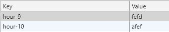
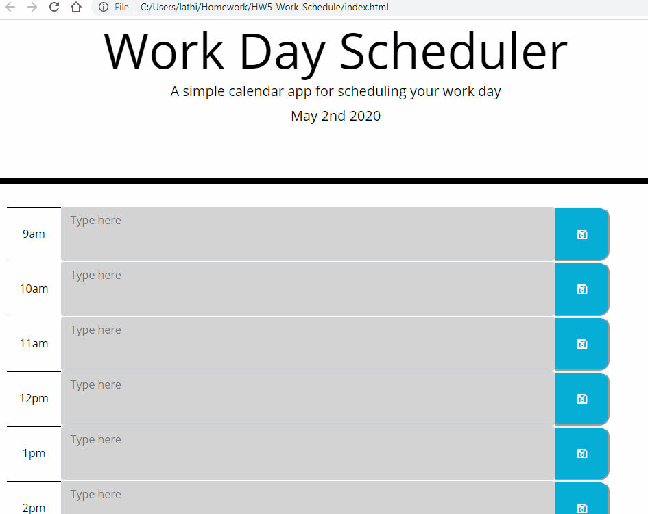

# HW5-Work-Schedule

## Description

- A work day schedule that allows user to save events typed into the text area for each hour between 9am to 5pm. It is color coded to visually help the user identify the current time without refrencing anything outside of the calendar.

## Technologies Used:

1. HTML
2. CSS
3. Javascript
4. Twitter Bootstrap
5. Font Awesome
6. Google Fonts

## Essential Code

- Using local storage, it saves the users input into a key, which is identified as the id time-9 and 10, and the value given to them is user input.

## Gif Walkthrough

